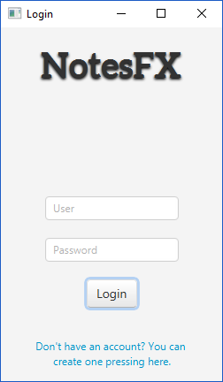
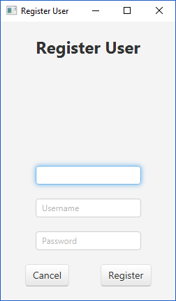
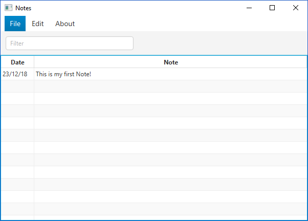

# Notes-FX

## Notes-FX is a cross-platform Java 8 based Desktop app built with JavaFX and SQLite to create, edit, view and delete personal notes.

**NotesFX** is a simple CRUD application built to show the power and simplicity of the `JavaFX` framework.

For database, it uses `SQLite` as driver (tested on `3.23.1`), but you can replace it for the one you like the most.

It also uses the `Bootstrap 2` theme by `dicolar`.
For more info check: https://github.com/dicolar/jbootx

## Images

